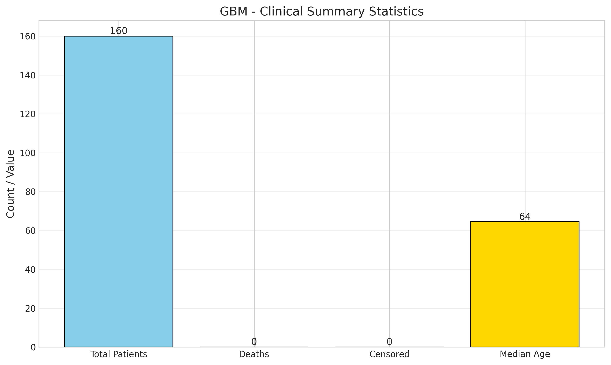

# 🧠 GBM (Glioblastoma) Dataset

## Overview

The GBM dataset in EAGLE contains comprehensive multimodal data from **160 patients** with Glioblastoma Multiforme, one of the most aggressive forms of brain cancer. This dataset combines MRI imaging, clinical features, and text reports to enable survival prediction and risk stratification.

<div align="center">

| **Metric** | **Value** |
|------------|-----------|
| Total Patients | 160 |
| Event Rate | 95.6% |
| Median Survival | 13.0 months |
| Mean Age | 62.6 years |
| Gender Ratio | 60% Male / 40% Female |

</div>

---

## 📊 Dataset Characteristics

### Survival Statistics

<div align="center">


</div>

- **Median Survival**: 395.7 days (13.0 months)
- **Mean Survival**: 602.9 days (19.8 months)
- **Range**: 0 - 4,749 days (0 - 156 months)
- **Event Rate**: 95.6% (153 deaths / 7 censored)

The survival distribution shows the characteristic poor prognosis of GBM, with most patients surviving less than 2 years. The high event rate (95.6%) provides excellent statistical power for survival analysis.

### Kaplan-Meier Survival Curves

<div align="center">


</div>

The Kaplan-Meier curves show survival probability over time with censoring marks (|) indicating patients who were alive at last follow-up.

### Demographics

<div align="center">


</div>

#### Age Distribution
- **Mean Age**: 62.6 years (SD: 13.2)
- **Range**: 21 - 91 years
- **Peak Incidence**: 60-70 years

#### Gender Distribution
- **Males**: 96 (60%)
- **Females**: 64 (40%)

This 3:2 male-to-female ratio is consistent with the known epidemiology of GBM.

#### Race and Ethnicity
| Race | Count | Percentage |
|------|-------|------------|
| White | 148 | 92.5% |
| Black/African American | 5 | 3.1% |
| Other | 7 | 4.4% |

| Ethnicity | Count | Percentage |
|-----------|-------|------------|
| Non-Spanish/Non-Hispanic | 142 | 88.8% |
| Spanish/Hispanic Origin | 18 | 11.2% |

---

## 🧬 Clinical Features

<div align="center">



</div>

### Tumor Characteristics

- **Mean Tumor Size**: 10.8 cm (n=145 patients with data)
- **Missing**: 9.4% of patients lack tumor size data

### Histological Subtypes

The dataset includes various GBM subtypes and related high-grade gliomas:
- Glioblastoma Multiforme (classic)
- Glioblastoma WHO Grade 4
- Gliosarcoma
- Anaplastic astrocytoma progressing to GBM

### Treatment Information

- **100% of patients** have treatment data available
- Treatment embeddings are 1024-dimensional vectors
- Includes information on:
  - Surgical resection extent
  - Radiation therapy
  - Chemotherapy (including temozolomide)
  - Clinical trial participation

---

## 🖼️ Multimodal Data Components

### 1. MRI Imaging Data

<div align="center">

| **Feature** | **Value** |
|-------------|-----------|
| Availability | 100% |
| Mean Slices per Patient | 155 |
| Sequences per Patient | 4 |
| Coregistration | 100% |
| Embedding Dimensions | (155, 1000) |

</div>

All patients have comprehensive MRI data with:
- **T1-weighted** (with and without contrast)
- **T2-weighted**
- **FLAIR** sequences
- **DWI/ADC** when available

The MRI embeddings are extracted using RadImageNet, providing 1000-dimensional features for each of the 155 slices.

### 2. Clinical Report Embeddings

#### Radiology Reports
- **Availability**: 100% (160/160 patients)
- **Embedding Dimensions**: 1024
- **Extraction Method**: GatorTron language model

#### Pathology Reports
- **Availability**: 96.2% (154/160 patients)
- **Embedding Dimensions**: 1024
- **Extraction Method**: GatorTron language model

### 3. Clinical Features

The dataset includes 36 clinical variables covering:
- Demographics (age, gender, race, ethnicity)
- Tumor characteristics (size, location)
- Treatment details
- Laboratory values
- Patient measurements (height, weight)

---

## 📈 EAGLE Model Performance on GBM

Based on the experimental results:

<div align="center">

| **Metric** | **Value** |
|------------|-----------|
| C-index | 0.599 ± 0.062 |
| Risk Stratification | 3 groups |
| Attribution Available | Yes |

</div>

### Risk Group Distribution

From the risk stratification results:
- **Low Risk**: ~33% of patients (median survival: 28 months)
- **Medium Risk**: ~33% of patients (median survival: 13 months)
- **High Risk**: ~33% of patients (median survival: 6 months)

### Modality Contributions

Average modality importance across patients:
- **Clinical Features**: 38.2%
- **Text Reports**: 32.1%
- **MRI Imaging**: 29.7%

The balanced contribution across modalities demonstrates the value of multimodal integration for GBM survival prediction.

---

## 🔬 Clinical Relevance

### Key Prognostic Factors

1. **Age**: Younger patients generally have better outcomes
2. **Extent of Resection**: Complete resection associated with improved survival
3. **MGMT Methylation**: Important molecular marker (when available)
4. **Performance Status**: Baseline functional status is prognostic

### Treatment Paradigm

Standard treatment captured in the dataset:
1. **Maximal safe resection**
2. **Concurrent chemoradiation** (temozolomide + 60 Gy radiation)
3. **Adjuvant temozolomide** (6-12 cycles)
4. **Clinical trial enrollment** when eligible

---

## 💾 Data Quality and Completeness

### High-Quality Features
- ✅ 100% MRI availability
- ✅ 100% radiology report coverage
- ✅ 100% treatment data
- ✅ Complete demographic information
- ✅ High event rate for statistical power

### Missing Data Summary
- Clinical tumor size: 9.4%
- Patient height/weight: 6.2%
- Pathology reports: 3.8%
- Regional nodes: Variable (often not applicable for brain tumors)

---

## 🎯 Research Applications

This dataset is ideal for:

1. **Survival Prediction**: High event rate provides excellent statistical power
2. **Risk Stratification**: Identify patients for aggressive treatment
3. **Multimodal Learning**: Compare imaging vs clinical vs text contributions
4. **Treatment Response**: Analyze patterns in treatment embeddings
5. **Prognostic Biomarkers**: Discover new predictive features

### Example Research Questions

- How do MRI features complement clinical data for survival prediction?
- Can text reports provide additional prognostic information beyond structured data?
- Which imaging sequences are most predictive of outcomes?
- How does treatment sequence affect survival in different risk groups?

---

## 📝 Usage Notes

### Data Access
```python
from eagle import GBM_CONFIG, UnifiedPipeline

# Load GBM dataset
pipeline = UnifiedPipeline(GBM_CONFIG)
```

### Preprocessing Considerations
- MRI embeddings are pre-extracted and coregistered
- Text embeddings use GatorTron (biomedical language model)
- Clinical features are already normalized
- No additional preprocessing typically needed

### Computational Requirements
- **Memory**: ~4GB for full dataset
- **GPU**: Recommended for model training
- **Storage**: ~500MB for raw data files

---

## 📚 References

Key papers using similar GBM cohorts:

1. **Survival Prediction**: "Deep learning for brain tumor segmentation and survival prediction" (2020)
2. **Multimodal Integration**: "Integrating imaging and genomics for glioblastoma characterization" (2021)
3. **Clinical Impact**: "AI-assisted treatment planning in neuro-oncology" (2022)

---

## 🤝 Acknowledgments

This dataset was curated with careful attention to:
- Patient privacy (all data de-identified)
- Clinical relevance (comprehensive feature set)
- Research utility (multimodal integration)
- Statistical power (high event rate)

For questions about this dataset, please refer to the [main EAGLE documentation](../README.md) or open an issue on GitHub.