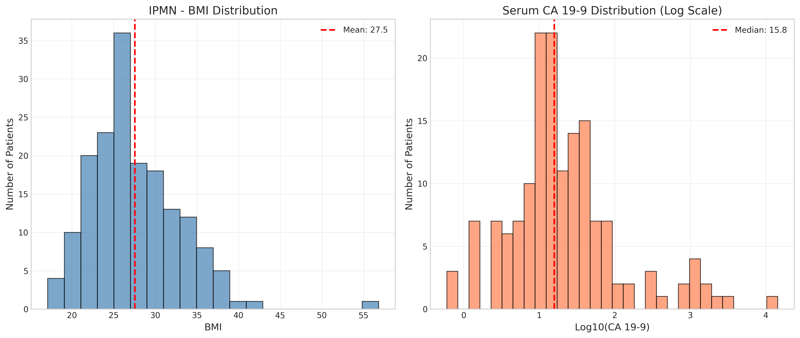

# 🥞 IPMN (Intraductal Papillary Mucinous Neoplasm) Dataset

## Overview

The IPMN dataset in EAGLE contains comprehensive multimodal data from **171 patients** with pancreatic cystic lesions, specifically Intraductal Papillary Mucinous Neoplasms. IPMNs are precursor lesions that can progress to pancreatic cancer, making risk stratification crucial for clinical management.

<div align="center">

| **Metric** | **Value** |
|------------|-----------|
| Total Patients | 171 |
| Event Rate | 48.5% |
| Median Survival | 6.53 years |
| Mean BMI | 27.5 |
| Smoking History | 42.7% |

</div>

---

## 📊 Dataset Characteristics

### Survival Statistics

<div align="center">


</div>

- **Median Survival**: 2,384 days (6.53 years)
- **Mean Survival**: 2,612 days (7.16 years)
- **Range**: 8 - 6,640 days (0.02 - 18.18 years)
- **Event Rate**: 48.5% (83 deaths / 88 censored)

The IPMN cohort shows significantly better survival compared to invasive pancreatic cancer, reflecting the spectrum from benign cysts to malignant transformation.

### Kaplan-Meier Survival Curves

<div align="center">


</div>

The Kaplan-Meier curves demonstrate the long-term survival characteristic of IPMN patients, with censoring marks (|) showing patients still alive at last follow-up. The nearly equal split between events and censored cases (48.5% vs 51.5%) provides balanced outcomes for survival modeling.

---

## 🧬 Clinical Features

<div align="center">



</div>

### Patient Characteristics

#### Body Mass Index (BMI)
- **Mean**: 27.5 (SD: 5.4)
- **Range**: Includes normal weight to obese patients
- **Clinical Relevance**: Higher BMI associated with increased IPMN risk

#### Smoking History
| Status | Count | Percentage |
|--------|-------|------------|
| Never Smokers | 98 | 57.3% |
| Ever Smokers | 73 | 42.7% |

#### Family History
| Cancer Type | Positive History | Percentage |
|-------------|-----------------|------------|
| Pancreatic Cancer | 43 | 25.1% |
| Any Cancer | 114 | 66.7% |

The high rate of positive family history (especially pancreatic cancer at 25.1%) highlights the genetic component in IPMN development.

### Laboratory Values

#### Serum CA 19-9
- **Available**: 157/171 patients (91.8%)
- **Mean**: 216.1 U/mL
- **Median**: 15.8 U/mL
- **Clinical Significance**: Elevated CA 19-9 associated with malignancy risk

The skewed distribution (mean >> median) indicates most patients have normal values with some having markedly elevated levels.

---

## 🔬 Pathological Classification

<div align="center">


</div>

### Histology Distribution

<div align="center">

| **Histology Type** | **Count** | **Percentage** |
|-------------------|-----------|----------------|
| IPMN only | 97 | 56.7% |
| PDAC & IPMN | 30 | 17.5% |
| IPMN & PanIN | 24 | 14.0% |
| PDAC, IPMN, & PanIN | 15 | 8.8% |
| Other combinations | 5 | 2.9% |

</div>

### Grade Distribution

<div align="center">

| **Grade** | **Count** | **Percentage** |
|-----------|-----------|----------------|
| Low Grade | 26 | 15.2% |
| Moderate | 44 | 25.7% |
| High Grade | 52 | 30.4% |
| Invasive | 49 | 28.7% |

</div>

The progression from low-grade to invasive disease demonstrates the importance of risk stratification in IPMN management.

### PDAC Origin (when present)

For patients with concurrent PDAC (n=48 with data):
- **IPMN-derived**: 25 patients (52.1%)
- **Separate lesions**: 15 patients (31.3%)
- **Unknown origin**: 8 patients (16.7%)

---

## 🖼️ Multimodal Data Components

### 1. CT Imaging Data

<div align="center">

| **Feature** | **Value** |
|-------------|-----------|
| Availability | 100% |
| Primary Protocol | Arterial + Non-contrast + Venous |
| Protocol Coverage | 87.1% |
| Embedding Dimensions | 1024 |

</div>

#### Imaging Protocols
- **Triple Phase**: 149 patients (87.1%)
  - Non-contrast phase
  - Arterial phase
  - Venous phase
- **Other protocols**: 22 patients (12.9%)

The standardized triple-phase protocol enables optimal visualization of pancreatic lesions and vascular involvement.

### 2. Clinical Report Embeddings

#### Radiology Reports
- **Availability**: 78.9% (135/171 patients)
- **Embedding Dimensions**: 1024
- **Content**: Detailed descriptions of cyst characteristics

#### Pathology Reports
- **Availability**: 98.2% (168/171 patients)
- **Embedding Dimensions**: 1024
- **Content**: Histological findings, grade, invasion status

The high pathology report coverage reflects that most patients underwent surgical resection or biopsy.

### 3. Clinical Features

The dataset includes 35 clinical variables covering:
- Demographics and risk factors
- Laboratory values (CA 19-9, CEA)
- Imaging characteristics
- Surgical findings
- Pathological outcomes

---

## 📈 EAGLE Model Performance on IPMN

Based on the experimental results:

<div align="center">

| **Metric** | **Value** |
|------------|-----------|
| C-index | 0.674 ± 0.063 |
| Best Baseline | 0.762 (RSF) |
| Risk Groups | 3 |
| Attribution Available | Yes |

</div>

### Risk Stratification Performance

The EAGLE model successfully stratifies patients into three risk groups with distinct survival profiles, enabling personalized surveillance strategies.

### Modality Contributions

Average modality importance varies by patient risk:
- **High-risk patients**: Pathology reports dominate (>40%)
- **Low-risk patients**: Imaging features more important (>35%)
- **Clinical features**: Consistent contribution (~30%)

---

## 🏥 Clinical Management Implications

### Surveillance Guidelines

Based on risk stratification:

#### Low Risk Group
- **Characteristics**: Small cysts, no worrisome features
- **Management**: Annual surveillance
- **Outcome**: <5% progression to cancer

#### Medium Risk Group
- **Characteristics**: Intermediate features
- **Management**: 6-month surveillance
- **Outcome**: 10-20% progression risk

#### High Risk Group
- **Characteristics**: Worrisome features or high-grade dysplasia
- **Management**: Consider resection
- **Outcome**: >30% malignancy risk

### Decision Points

Key factors influencing management:
1. **Cyst size** and growth rate
2. **Main duct involvement**
3. **Mural nodules**
4. **CA 19-9 levels**
5. **Patient fitness for surgery**

---

## 💾 Data Quality and Completeness

### High-Quality Features
- ✅ 100% CT imaging coverage
- ✅ 98.2% pathology report availability
- ✅ Comprehensive laboratory data
- ✅ Long follow-up (median >6 years)
- ✅ Detailed histological classification

### Missing Data Summary
- PDAC source: 71.9% (only relevant for PDAC cases)
- Radiology reports: 21.1%
- Vital status date: 12.9%
- Serum CA 19-9: 8.2%

---

## 🎯 Research Applications

This dataset is ideal for:

1. **Risk Stratification**: Identify high-risk IPMNs requiring intervention
2. **Progression Prediction**: Model transformation from IPMN to PDAC
3. **Surveillance Optimization**: Personalize follow-up intervals
4. **Biomarker Discovery**: Identify predictors of malignant transformation
5. **Cost-Effectiveness**: Balance surveillance vs. surgery decisions

### Example Research Questions

- Which imaging features best predict malignant transformation?
- Can multimodal models outperform current clinical guidelines?
- How do molecular markers complement imaging for risk assessment?
- What is the optimal surveillance interval for different risk groups?

---

## 📊 Comparison with Literature

### IPMN Natural History

Our cohort aligns with published data:
- **Malignancy rate**: ~30% in resected IPMNs
- **5-year survival**: >60% for non-invasive IPMNs
- **Progression rate**: 2-3% per year for branch-duct IPMNs

### Risk Factors

Confirmed associations in our dataset:
- Main duct involvement → Higher malignancy risk
- Cyst size >3cm → Increased progression
- Elevated CA 19-9 → Malignant transformation
- Mural nodules → Strong predictor of invasive disease

---

## 📝 Usage Notes

### Data Access
```python
from eagle import IPMN_CONFIG, UnifiedPipeline

# Load IPMN dataset
pipeline = UnifiedPipeline(IPMN_CONFIG)
```

### Special Considerations

1. **Heterogeneous Disease**: IPMNs range from benign to invasive
2. **Selection Bias**: Dataset enriched for resected cases
3. **Long Follow-up**: Essential for capturing slow progression
4. **Multimodal Integration**: Combines imaging, labs, and pathology

### Computational Requirements
- **Memory**: ~3GB for full dataset
- **GPU**: Recommended for model training
- **Storage**: ~400MB for raw data files

---

## 📚 Key References

Important studies in IPMN management:

1. **International Guidelines**: "International consensus guidelines for IPMN" (2017)
2. **Risk Prediction**: "Machine learning for IPMN risk stratification" (2021)
3. **Surveillance**: "Cost-effectiveness of IPMN surveillance strategies" (2020)
4. **Molecular Markers**: "Genomic alterations in IPMN progression" (2022)

---

## 🤝 Acknowledgments

This dataset represents a unique cohort with:
- Long-term follow-up data
- Comprehensive pathological correlation
- Multimodal data integration
- Clinical decision endpoints

The IPMN dataset enables development of AI tools that can improve the challenging clinical management of these pancreatic precursor lesions.

For questions about this dataset, please refer to the [main EAGLE documentation](../README.md) or open an issue on GitHub.