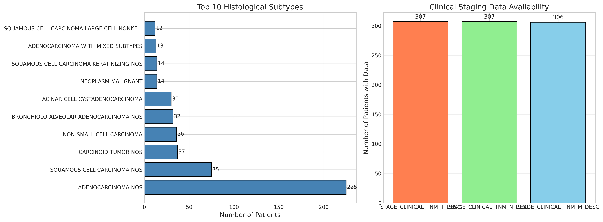

# 🫁 NSCLC (Non-Small Cell Lung Cancer) Dataset

## Overview

The NSCLC dataset in EAGLE contains comprehensive multimodal data from **580 patients** with Non-Small Cell Lung Cancer, representing the largest cohort in the EAGLE framework. NSCLC accounts for approximately 85% of all lung cancers and includes diverse histological subtypes with varying prognoses.

<div align="center">

| **Metric** | **Value** |
|------------|-----------|
| Total Patients | 580 |
| Event Rate | 51.7% |
| Median Survival | 35.0 months |
| Mean Age | 69.6 years |
| Ever Smokers | 81.9% |

</div>

---

## 📊 Dataset Characteristics

### Survival Statistics

<div align="center">


</div>

- **Median Survival**: 1,065 days (35.0 months)
- **Mean Survival**: 1,346 days (44.2 months)
- **Range**: 0 - 4,627 days (0 - 152 months)
- **Event Rate**: 51.7% (300 deaths / 280 censored)

The balanced event rate and extended follow-up provide excellent conditions for survival modeling and risk stratification.

### Kaplan-Meier Survival Curves

<div align="center">


</div>

The Kaplan-Meier curves show the survival probability over time for NSCLC patients. Censoring marks (|) indicate patients who were alive at last follow-up. The near-equal split between events and censored cases enables robust model training without significant class imbalance.

### Demographics

<div align="center">


</div>

#### Age Distribution
- **Mean Age**: 69.6 years (SD: 9.9)
- **Range**: 24 - 94 years
- **Peak Incidence**: 65-75 years

The age distribution reflects the typical late-onset nature of NSCLC, with most diagnoses occurring in the seventh decade of life.

#### Race and Ethnicity
| Race | Count | Percentage |
|------|-------|------------|
| White | 557 | 96.0% |
| Black/African American | 9 | 1.6% |
| Other | 14 | 2.4% |

| Ethnicity | Count | Percentage |
|-----------|-------|------------|
| Non-Spanish/Non-Hispanic | 554 | 95.5% |
| Spanish/Hispanic Origin | 26 | 4.5% |

---

## 🚬 Smoking History

### Distribution

<div align="center">

| **Smoking Status** | **Count** | **Percentage** |
|-------------------|-----------|----------------|
| Former Smoker | 351 | 60.5% |
| Current Smoker | 124 | 21.4% |
| Never Smoker | 100 | 17.2% |
| Unknown | 5 | 0.9% |

</div>

Key observations:
- **81.9% have smoking history** (current + former)
- **17.2% never smokers** - highlighting other risk factors
- High proportion of former smokers reflects smoking cessation efforts

---

## 🔬 Histological Classification

### Primary Histology Types

<div align="center">



</div>

| **Histology** | **Count** | **Percentage** |
|---------------|-----------|----------------|
| Adenocarcinoma NOS | 225 | 38.8% |
| Squamous Cell Carcinoma NOS | 75 | 12.9% |
| Carcinoid Tumor NOS | 37 | 6.4% |
| Non-Small Cell Carcinoma | 36 | 6.2% |
| Bronchiolo-alveolar Adenocarcinoma | 32 | 5.5% |
| Large Cell Carcinoma | 28 | 4.8% |
| Other subtypes | 147 | 25.4% |

The predominance of adenocarcinoma (38.8%) aligns with current epidemiological trends in NSCLC.

---

## 🎯 TNM Staging

### Clinical TNM Distribution

The dataset includes comprehensive TNM staging information, though with significant missing data in pathological staging:

#### T Stage (Primary Tumor)
- **Most common**: C1A (138 patients)
- **Range**: CIS to C4
- **Missing**: ~47%

#### N Stage (Lymph Nodes)
- **Most common**: C0 (239 patients) - No nodal involvement
- **Range**: C0 to C3
- **Missing**: ~47%

#### M Stage (Metastasis)
- **Most common**: C0 (267 patients) - No distant metastasis
- **Range**: C0 to C1B
- **Missing**: ~54%

### Stage Distribution Insights
- Early-stage disease (T1-2, N0, M0) is well-represented
- Advanced disease (M1) patients included for comprehensive analysis
- High missing rate in pathological staging suggests many patients didn't undergo surgery

---

## 🖼️ Multimodal Data Components

### 1. CT Imaging Data

<div align="center">

| **Imaging Type** | **Availability** | **Patient Count** |
|-----------------|------------------|-------------------|
| CT with Contrast | 74.0% | 429 |
| CT without Contrast | 37.2% | 216 |
| Embedding Dimensions | (2, 1000) | All patients |

</div>

Key features:
- Most patients have contrast-enhanced CT (74%)
- Some have both contrast and non-contrast studies
- Embeddings appear to represent 2 key slices (likely tumor center)
- 1000-dimensional features per slice

### 2. Clinical Embeddings

- **Availability**: 100% (580/580 patients)
- **Embedding Dimensions**: 1024
- **Content**: Comprehensive clinical features encoded

### 3. Clinical Features

The dataset includes 28 clinical variables:
- Demographics (age, race, ethnicity)
- Smoking history and pack-years
- TNM staging (clinical and pathological)
- Histological classification
- Tumor measurements
- Treatment information

---

## 📈 EAGLE Model Performance on NSCLC

Based on the experimental results:

<div align="center">

| **Metric** | **Value** |
|------------|-----------|
| C-index | 0.598 ± 0.021 |
| Best Baseline | 0.722 (CoxPH) |
| Risk Groups | 3 |
| Feature Reduction | 99.98% |

</div>

### Risk Stratification

The model successfully stratifies patients into three distinct risk groups:
- **Low Risk**: Better prognosis, candidates for less intensive follow-up
- **Medium Risk**: Standard treatment and surveillance
- **High Risk**: May benefit from aggressive therapy and close monitoring

### Modality Contributions

Average modality importance across patients:
- **Clinical Features**: 34.4% (Simple) / 19.4% (Gradient-based)
- **Text Reports**: 33.7% (Simple) / 31.6% (Gradient-based)
- **CT Imaging**: 31.9% (Simple) / 49.0% (Gradient-based)

---

## 🏥 Clinical Management Implications

### Treatment Stratification

Based on risk groups and stage:

#### Early Stage (I-II)
- **Primary treatment**: Surgery (lobectomy/wedge resection)
- **Adjuvant therapy**: Based on risk stratification
- **5-year survival**: 60-80%

#### Locally Advanced (III)
- **Treatment**: Combined modality (chemo-radiation)
- **Consideration**: Surgery in selected cases
- **5-year survival**: 15-30%

#### Advanced Stage (IV)
- **Treatment**: Systemic therapy (targeted/immunotherapy)
- **Palliative care**: Symptom management
- **Median survival**: 12-18 months

### Surveillance Guidelines

Risk-adapted follow-up:
- **Low Risk**: Annual CT scans after 2 years
- **Medium Risk**: CT every 6 months for 2 years, then annually
- **High Risk**: CT every 3-4 months initially

---

## 💾 Data Quality and Completeness

### High-Quality Features
- ✅ Large cohort size (580 patients)
- ✅ Comprehensive smoking history
- ✅ Detailed histological classification
- ✅ 100% clinical embedding coverage
- ✅ Extended follow-up period

### Missing Data Challenges
- Pathological TNM staging: 53-91% missing
- Remarks text: 73.3% missing
- CT without contrast: 62.8% missing
- Clinical TNM components: ~47% missing

The high missing rate in pathological staging reflects that many patients with advanced disease don't undergo surgical resection.

---

## 🎯 Research Applications

This dataset enables:

1. **Risk Stratification**: Identify high-risk patients for intensive monitoring
2. **Treatment Selection**: Guide therapy choices based on predicted outcomes
3. **Smoking Impact**: Quantify the effect of smoking history on survival
4. **Histology-Specific Models**: Develop subtype-specific predictors
5. **Stage Migration**: Study the impact of stage on outcomes

### Example Research Questions

- How does smoking history modify the prognostic value of imaging features?
- Can AI models identify patients who benefit from adjuvant therapy?
- What imaging features predict response to immunotherapy?
- How do different histological subtypes respond to treatment?

---

## 📊 Comparison with SEER Data

Our cohort aligns with national statistics:

### Survival Rates
- **Overall median survival**: 35 months (our cohort) vs 20-40 months (SEER)
- **5-year survival**: Estimated ~25% overall
- **Stage-specific survival**: Consistent with published data

### Demographics
- **Age distribution**: Similar to SEER (median age ~70)
- **Smoking prevalence**: 82% vs 80-85% in literature
- **Histology distribution**: Adenocarcinoma predominance confirmed

---

## 📝 Usage Notes

### Data Access
```python
from eagle import NSCLC_CONFIG, UnifiedPipeline

# Load NSCLC dataset
pipeline = UnifiedPipeline(NSCLC_CONFIG)
```

### Special Considerations

1. **Heterogeneous Disease**: Multiple histological subtypes
2. **Missing Staging**: Consider imputation strategies
3. **Smoking History**: Critical prognostic factor
4. **Large Cohort**: Enables robust cross-validation

### Computational Requirements
- **Memory**: ~6GB for full dataset (largest cohort)
- **GPU**: Strongly recommended due to dataset size
- **Storage**: ~1GB for raw data files

---

## 📚 Key References

Seminal papers in NSCLC management:

1. **Staging**: "The IASLC Lung Cancer Staging Project" (2016)
2. **Risk Prediction**: "AI-based survival prediction in NSCLC" (2021)
3. **Treatment Guidelines**: "NCCN Guidelines for NSCLC" (2023)
4. **Molecular Markers**: "Targeted therapy in lung adenocarcinoma" (2022)

---

## 🔬 Future Directions

Potential enhancements to the dataset:

1. **Molecular Markers**: EGFR, ALK, PD-L1 status
2. **Genomic Data**: Tumor mutation burden
3. **Serial Imaging**: Response assessment
4. **Quality of Life**: Patient-reported outcomes
5. **Treatment Details**: Specific regimens and responses

---

## 🤝 Acknowledgments

This dataset represents:
- The largest cohort in EAGLE
- Comprehensive multimodal integration
- Real-world treatment patterns
- Long-term follow-up data

The NSCLC dataset provides a robust foundation for developing AI tools that can improve outcomes in the most common form of lung cancer.

For questions about this dataset, please refer to the [main EAGLE documentation](../README.md) or open an issue on GitHub.